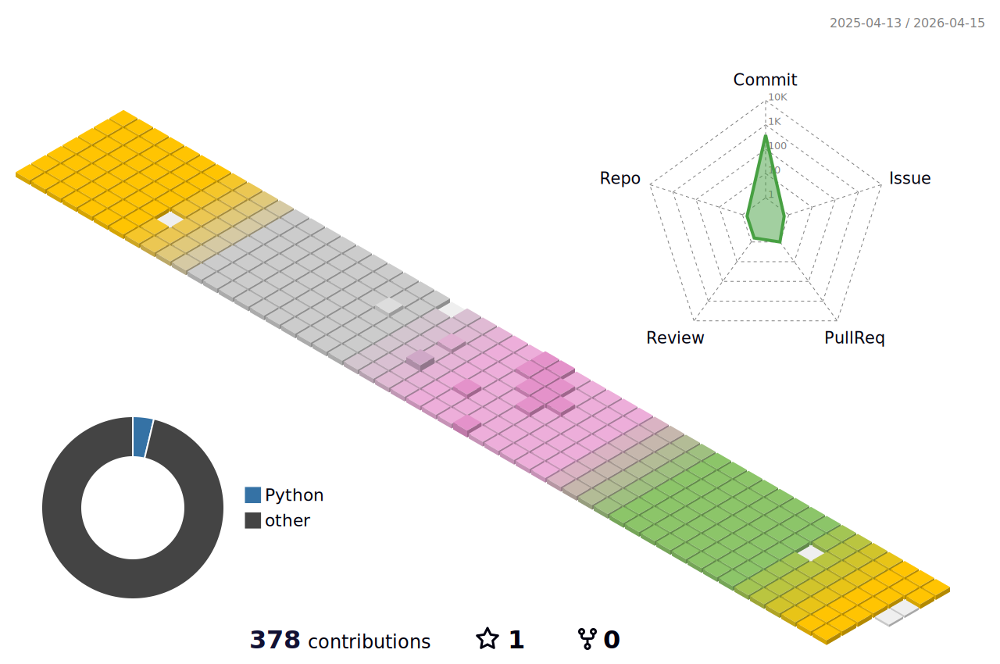

  <h1>Hi there! 👋 I'm Hyunwoo Jeong, Frontend Developer.</h1>
  I started learning software for the first time on January 2, 2023.  
  Since I started later than others, I will try to grow more and harder.  
  Please watch carefully in the future. Thank you!👍 

  <h3> Contact me</h3>
  

    
    
  

  

### 👩🏻‍🎓 Educations & Careers

- 2023.01 - 2023.12 삼성 청년 SW 아카데미 (SSAFY) 9th
- 2016.03 - 2022.08 서울과학기술대학교 전자IT미디어공학과 (졸업)

 

### 🛠️ Tech Stack

  
  <b>Frontend　</b>
  
  
  
  
  
  
  
  
  
  
    
  
  <b>Etc　</b>
  
  
  
  
  

 

### 💻 Project

|      Period       |       Category        |                            Project                             |                   Description                      |   Scale  |
| :---------------: | :-------------------: | :------------------------------------------------------------: | -------------------------------------------------- | :------: |
| 2023.10 - 2023.11 |        Webapp         | [구급대장](https://github.com/hyo-nu/gu-geup-dae-jang)         | 실시간 구급 이송 지원 서비스                        | 6인 Team |
| 2023.08 - 2023.10 |        Webapp         | [Billage](https://github.com/B-108/Billage)                    | 가까운 지인과의 안전한 거래를 위한 어플리케이션     | 6인 Team |
| 2023.07 - 2023.08 |          Web          | [VOSS](https://github.com/hyo-nu/VOSS)                         | WebRTC를 활용한 성우 지망생 연습 플랫폼             | 6인 Team |
| 2023.05 - 2023.05 |          Web          | [CHOICE](https://github.com/hyo-nu/CHOICE)                     | TMDB 영화 API를 활용한 영화 추천 커뮤니티           | 2인 Team |

 

### ✍️ Problem Solving 

  
  

 

### 📈 GitHub Analytics

  

