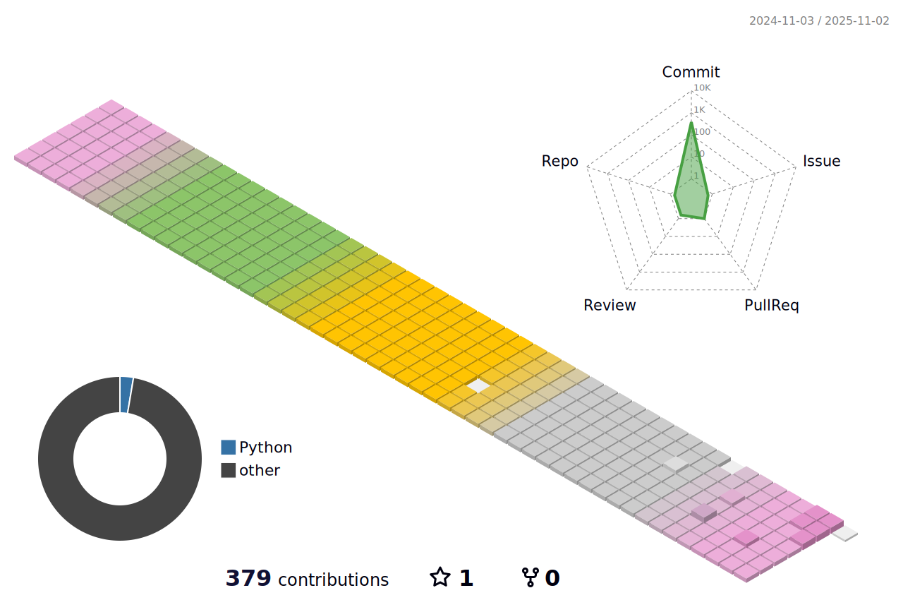

### Hi there 👋

  

    <h3 style ="font-size : 2em; font-weight:700;">💙Contact💙</h3>
    

      
      
      
    

  

  

  

  <h3 style ="font-size : 2em; font-weight:700;">🍀Tech Stack🍀</h3>
    
<h3 key=0 style ="font-size : 1.5em; font-weight:700;"></h3>
         
<h3 key=1 style ="font-size : 1.5em; font-weight:700;"></h3>

  

   ### 💻 Project

  |      Period       |       Category        | Project                                                        | Description                                       |
  | :---------------: | :-------------------: | :------------------------------------------------------------: | --------------------------------------------------|
  | 2023.10 - 2023.11 |          Webapp       | [구급대장](https://github.com/hyo-nu/gu-geup-dae-jang)         | 실시간 구급 이송 지원 서비스                       |
  | 2023.08 - 2023.10 |          Webapp       | [Billage](https://github.com/B-108/Billage)                    | 가까운 지인과의 안전한 거래를 위한 어플리케이션    |
  | 2023.07 - 2023.08 |          Web          | [VOSS](https://github.com/hyo-nu/VOSS)                         | WebRTC를 활용한 성우 지망생 연습 플랫폼            |
  | 2023.05 - 2023.05 |          Web          | [CHOICE](https://github.com/hyo-nu/CHOICE)                     | TMDB 영화 API를 활용한 영화 추천 커뮤니티          |

  

    
    
  

  

